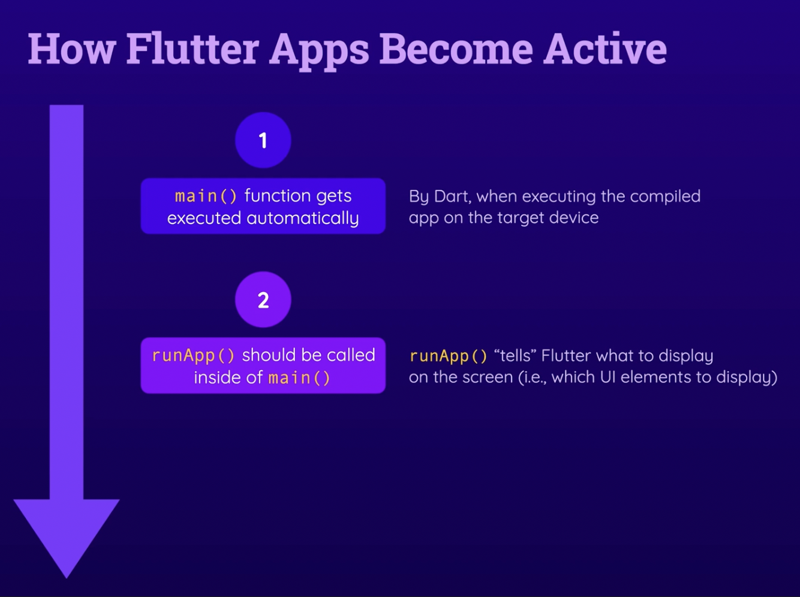

<br/>

---

## 목차

- [Ch01. Flutter Basic](#ch01-flutter-Basic) <br/>
- [Ch02. Debugging Flutter](#ch02-Debugging-flutter) <br/>
- [Ch03. Flutter State Basic](#ch03-flutter-state-basic) <br/>
- [Ch04. Flutter Architecture](#ch04-flutter-architecture) <br/>

<br/>

---

## Ch01. Flutter Basic

### 01. Widget 이란 무엇인가요?

- Widget은 Flutter UI의 가장 기본적인 단위로 간단한 블록부터 텍스트입력창, 특정 요소 간격조차 Widget으로 관리됩니다.
- Flutter 개발자의 필수 요구사항으로 이러한 Widget을 얼마나 적재적소에 효과적으로 활용할 수 있느냐 입니다. <br/>

#

### 02. Widget Tree란 무엇인가요?

- Flutter Widget은 마치 블록과 같습니다. 어떻게 조합하느냐에 따라 전혀 다른 UI를 나오기도 하고 재사용하기도 합니다
- 이 때, Widget은 수평적,수직적인 관계가 만들어지는데 이런 관계를 나타낸 형태를 Widget tree 라고 부르며 추후 상태 관리하는 데 있어 중요한 개념입니다<br/><br/>

#

### 03.  import는 어떤용도인가요?

- 현재 사용하고 있는 다트 파일 외에 다른 다트 파일을 쓰기 위해서 가장 먼저 import를 선언해줍니다<br/>

#

### 04. `Scaffold()`란 무엇인가요?

&nbsp;&nbsp;&nbsp;&nbsp;<br/>

- 위젯 트리 최상위에 위치하는 `MaterialApp()`에서 화면을 구성하는 가장 기본적인 도화지 역할을 수행합니다
- 이러한 `Scaffold()` 는 기본화면을 가장 쉽게만들 수 있는 방법 중 하나입니다<br/><br/>

#

### 05. Hot restart 와 Hot reload 의 차이점은 무엇인가요?

- **Hot restart**는 앱을 재시작하는 형태입니다 이 기능을 활용하면 앱의 모든 상태가 초기화되고 변경사항을 반영합니다
- **Hot reload**는 앱을 재실행하지는 않지만 코드의 변경사항을 반영합니다. 이를 통해 앱의 상태를 유지한채로 수정사항을 확인하여 더욱 빠른 개발을 할 수 있습니다<br/><br/>

#

### 06. Hot restart/Hot reload 사용시 주의사항에 대해서 알려주세요

- 둘 모두 앱을 재 컴파일 후 빌드하는 것이 아니기 때문에 앱의 기초가 되는 네이티브 코드 수정이나, 라이브러리, Asset의 추가등 상황에서는 정상적으로 작동하지 ㅇ낳습니다
- 또한 지나치게 많은 변경사항이 있거나 추후 상태 관리 개발 단계에 도달하면 해당 기능 사용에 주의를 요합니다<br/>

#

### 07.  Material Design 과 Cupertino Design 에 대해서 설명해주세요

- Flutter 내에서는 대표적인 2개의 디자인 가이드를 활용하여 개발할 수 있습니다(물론 커스텀 디자인도 가능)
- 구글 철학이 녹아져 있는 디자인 가이드는 Material Design, Apple의 철학이 녹아져 있는 디자인 가이드는 Cupertino Design이라고 구분짓고 있습니다
- 해당 디자인 가이드를 디바이스에 따라 분리 구현할 수도 있습니다<br/><br/>

#

### 08. `Container()` 에 대해서 설명해주세요

&nbsp;&nbsp;&nbsp;&nbsp;<br/>

- `Container()` 는 가장 기본적인 위젯 중 하나입니다
- `Container()`는 `child`를 통해서 내부에 들어갈 위젯을 선언하게 됩니다
- Container는 기본적으로 width와 height값을 가질 수 있습니다<br/><br/>

#

### 09. padding 과 margin 에 대해 설명해주세요

&nbsp;&nbsp;&nbsp;&nbsp;<br/>

- Padding은 위젯외곽선과 내부 컨텍스트의 간격을 넓혀주는 값이고 주로 `EdgeInsets.formLTRP` 나 `EdgeInsets.symmetric` 을 통해 주로 구현합니다
- Margin은 패딩과 반대로 외부 경계선과 밖의 간격을 설정해주는 값으로 패딩과 마찬가지로 `formLTRP`, `symmetric` 을 통해 주고 구현합니다.<br/><br/>

#

### 10. 다트 파일은 어떻게 컴파일 과정을 거쳐서 Android / iOS 기기에서 작동되나요?

&nbsp;&nbsp;&nbsp;&nbsp;<br/>

- 먼저 Dart 파일이 처음 부터 끝까지 분석(Parse)됩니다
- Parse가 끝나면 flutter tool에 의해 타겟 플랫폼의 네이티브 언어로 번역됩니다.
- 이러한 네이티브 코드로 타켓 디바이스에서 실행됩니다. 

#

### 11. Words에 대해서 설명해주세요

&nbsp;&nbsp;&nbsp;&nbsp;<br/>

- 프로그래밍 언어의 Words에는 두가지 종류가 있습니다 -> Keywords 와 identifiers
- Keywords는 이미 빌트인된 단어로 `import`, `class`, `void` 등등이 있습니다
- identifiers는 개발자가 정의하는 단어입니다. 어떤 코드를 식별하기위해 사용합니다

#

### 12. 다른 함수와 `main()`함수의 차이점은 무엇인가요?

&nbsp;&nbsp;&nbsp;&nbsp;
&nbsp;&nbsp;&nbsp;&nbsp;<br/>

- 함수는 원래 정의 이후 called이 되어야만 실행됩니다.(괄호 안에서 한 번 실행해야함) 하지만 `main()`은 특별한 call 없이 바로 실행될 수 있습니다.
- 또한 `main()`은 자동적으로 프로젝트의 첫번째 함수로 실행됩니다.
- 플러터에서는 `main()`함수 내에서 반드시 `runApp()`이 실행되어야 합니다.
- `runApp()`은 플러터에게 화면을 그리라고 명령합니다(UI Elements to display)
- `runApp()` 의 파라미터로는 **widget tree** 가 들어갑니다. 이러한 위젯트리의 조합에 따라 user interface가 그려집니다.

#

### 13. `MaterialApp`이란 무엇인가요?

```dart
import package:flutter/material.dart';

void main() {
    runApp(MaterialApp(home: Text('flutter'),));
}
```

- `MaterialApp'도 플러터가 제공하는 하나의 위젯입니다.
- Material package를 import함으로서 시작점으로 자주 활용되는 main Widget 입니다
- Material package안에 다양한 함수와 속성을 미리 넣어놨기 때문에 값만 넣어주면 간편하게 ui가 만들어집니다.

#

### 14.다트에서 기본적인 함수 선언 방법을 말해주세요

```dart
void add({num1, num2}) {
  num1 + num2;
}

void demo() {
  add(num2: 5, num1: 3)
}
```
- 다트에서 기본적인 함수선언은 {} 안에 네임드 파라미터들을 넣으면 됩니다.

#

### 15. `const` 선언의 장점은 무엇인가요?

```dart
const Text('hello World!') //defined -> 디바이스 메모리 특정 주소< ... > 에 저장
const Text('hello World!') //used -> 특정 주소의 메모리를 그대로 가져옴
```
```dart
void main() {
  runApp(const MaterialApp(home: Text('Hello World!'))); // Text는 자동으로 const Text()로 선언된다.
}
```
- `const`로 선언할 경우 런타임 퍼포먼스를 최적화하여 성능향상을 기대할 수 있습니다
- 즉 메모리의 재사용성을 증가시킬 수 있습니다.
- 이때 `const`를 상위 위젯에서 선언할 경우 하위 위젯들은 자동으로 `const`로 선언됩니다

#

### 16. Scaffold 위젯이란 무엇인가요?

&nbsp;&nbsp;&nbsp;&nbsp;<br/>

``` dart
void main() {
  runApp(const MaterialApp(
    home: Scaffold(body:
      Text('Hello World!'),
    ), //Scaffold
   ), //MaterialApp
  );
}
```
- `MaterialApp`위젯은 기본적으로 root widget입니다.
- 앱은 다양한 UI위젯들로 구성되어 있습니다. 텍스트, 백그라운드 컬러 등등..
- 이러한 다양한 UI위젯들을 `Scaffold`로 묶어줍니다
- 이렇게 `MatrialApp`을 루트 위젯으로 하는 위젯트리가 만들어집니다

#

### 17. Dart 문법에서 type의 특징에 대해 말해주세요

&nbsp;&nbsp;&nbsp;&nbsp;<br/>

- Dart에서 모든 Value는 타입을 가지고 있습니다 (type safe language)
- 이때 하나의 타입만 가지는 것이 아닌 여러개의 타입을 가지게 됩니다.
- Dart에서는 모든 value는 기본적으로 객체이기 때문에 object라는 타입을 가지고 있습니다

#

### 18. Object에 대해 좀 더 설명해주세요

- 플러터에서 모든 것은 위젯입니다. 그리고 위젯은 모두 Object입니다. 위젯뿐만 아니라 모든 값은 object입니다.
- 이러한 Object는 메모리로서 데이터 구조의 단위입니다

#

### 19. 제너릭 타입에 대해 설명해주세요

```dart
//List<color>
colors: [
    Color.fromARGB(255, 78, 13, 151),
    Color.fromARGB(255, 107, 15, 168),
]
```

- 제너릭 타입은 타입에 대해 자율성을 열어놓은 타입입니다, < > 통해 표현합니다
- `List<Color>`의 경우 Color의 하위 타입 아무거나 배열에 넣을 수 있게됩니다. `colors: [Colors.deepPurple, color.fromARGB(255, 45, 7, 98)]`

#

### 20. Flutter의 Data Structure 관점에서 class를 설명해주세요

&nbsp;&nbsp;&nbsp;&nbsp;<br/>

- Dart에서 모든 값은 object입니다. 그리고 Object는 데이터입니다. 그리고 데이터는 컴퓨터 메모리에 저장됩니다
- Object라는 데이터(variable/properties)를 로직(functions/methods)에 의해 결합함으로서 결과물을 구현합니다.
- 클래스는 이러한 데이터와 로직을 묶어놓은 설계도입니다.

#

### 21.widget을 선언할 때 클래스와 다른점은 무엇인가요?

```dart
class GradientContainer extends StatelessWidget {
    @override
    Widget build(context){
        return 'Hello World!';
    }        
}
```
- 위젯도 클래스입니다. 하지만 단순히 설계도인 클래스와 다르게 위젯은 정적인 위젯(statless widget)과 동적인 위젯(state widget)으로 나누어집니다.
- 따라서 위젯은 상위클래스인 `StatelessWidget` 과 `StateWidget`의 하위클래스로서 확장하는 형식으로 구현됩니다. 이렇게 상위클래스의 속성과 메서드를 상속받음으로서 다양한 속성과 메서드를 활용할 수 있게됩니다.
- 위젯을 UI에 그리기 위해서는 `build()`함수를 호출해야합니다.이 빌드함수는 상위클래스(stateless, state widget)에서 상속받은 함수로 재정의를 하기위해 `@oveeride`키워드를 써줍니다
- 이때 `build()`함수는 super class에서 widget을 리턴하도록 선언되어 있습니다. 따라서 앞부분에 Widget을 붙여주도록 합니다.
- 또한 `build()`함수는 필수적으로 가져야할 파라미터가 있습니다 바로 `context`입니다. 이 컨텍스트는 위젯트리로 구체적으로 무얼 그릴지 내용물이 삽입되어집니다.
- 여기에 마지막에 리턴까지 적어주면 위젯선언의 기본셋팅을 마쳤다고 볼 수 있습니다. 이후에 어떻게 위젯의 내용물을 채울지 적어주면 됩니다.

#

### 22. Widget 선언시 생성자는 어떻게 작성하나요?

```dart
```

- 클래스이기 때문에 클래스안의 속성들을 초기화해주어야합니다. 이때 생성자 메서드의 아규먼트로 `key`를 사용합니다
- 

---

## Ch02. Debugging Flutter


